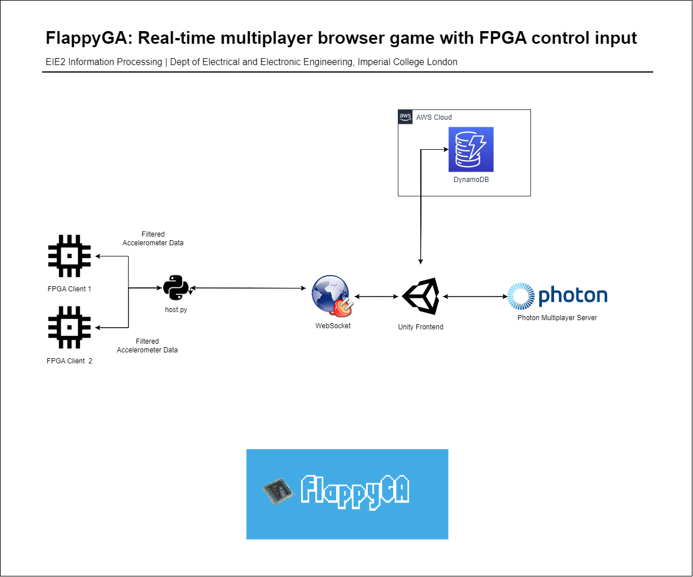

# FlappyGA: Real-Time Multiplayer Browser Game with FPGA Control Input

## Description

This repository contains code for FlappyGA, a game we created as part of our EIE2 Information Processing Project at Imperial College London based off of Flappy Bird.  

The game involves players tilting their FPGA up and down to move the character; it supports up to 8 players playing at once.  

### Requirements

The functional requirements of the system included:
  - Local Processing of Accelerometer Data: FPGA performs fixed-point FIR filtering on data from accelerometer sensor to smoothen it and remove noise.
  - Communication from Node to Server: FPGA accelerometer data is processed on a local computer, which determines the board tilt direction. This is then sent via a websocket to Unity.
  - Establishment of Cloud Server to Process Events: Photon Server is used to control the game state to allow for multiplayer. We use the DynamoDB SDK to update and get leaderboard data. 
  - Communication from Server to Nodes: The FPGA is updated with the number of jumps to inform the user how long he or she has lasted in the game.

## Architecture



## Documentation

### Folder Structure

Here's a folder structure for the project:

```
FlappyGA/                     # Root directory.
|- FPGA/                      # Folder used to store FPGA-related files (client).
|- ML/                        # Folder used to store Game AI-related files.
|- DocumentationAssets/       # Images folder.
|- game                       # Folder used to store Unity game. Open this folder as a existing Unity Project to access the game in the Unity editor.
```

### How Photon Works

Photon works by having a user connect to the Master Server; in this case it is through a Photon Unity Networking Application that I've set up using my API key. This user will then join a Lobby, and then subsequently a Room. This all happens automatically; with the exception of joining a Room - the user will have control over this.  

### Launching the Game

To launch the game on your local client, open the `game` folder in Unity. Go to Files, then select 'Build and Run...'. You will be able to open 1 instance of the game. Press the play button in the Unity editor to open another instance.  

You will then be able to enter your Nickname. Key in your name and press the button 'Set Name'. You will then enter the Main Menu - click 'Create Room' and enter your room name. Do note that no duplicate room names are allowed; you should see an error if this occurs.  

On your Development Build instance, do the same but click 'Find Room'. You should see your room name, which you can then click to join. You should see the names of both players in the room.  

There will be a 'Start Game' button on the Master Client. Clicking Start Game will cause both games to sync to the scene of choice (which should be another scene implementing the game logic - this should be Johan's `SampleScene`).  

Now what remains is to implement multiplayer functionality within `SampleScene`.  

### Class Reference (Member Function Documentation)

|Type|Member Function|Elaboration|
|---|---|---|
|private void|Start()|This function is run immediately upon game start. It will connect the user to the Photon Server using the inbuilt `PhotonNetwork.ConnectUsingSettings()` function from the `Photon.Pun` package.|
|void|CloseMenus()|This function allows us to toggle the display of all menus in the application. By running it we close all menus, which we then individually turn on again in later member functions.|
|public override void|OnConnectedToMaster()|This member function is run upon successful connection to the Photon Server. We then join a Lobby automatically. `PhotonNetwork.AutomaticallySyncScene()` is run to sync all clients to the same scene as the Master Client (1st user who joins).|
|public override void|OnJoinedLobby()|This function is run when the user has joined the lobby. It will ask the user to input a username. Note that this result is cached within Photon as `PlayerPrefs`, so if keyed in previously it will automatically appear. Else, a user will have to key in a new username.|
|public void|OpenRoomCreate()|This function brings up the `createRoomScreen`.|
|public void|CreateRoom()|This function allows the user to create a new room using a name of choice. Note that the max number of players is 8, but this can be adjusted in `options.MaxPlayers`.|
|public override void|OnJoinedRoom|This function is run upon joining a new room. We immediately list all players in the room and update the `roomNameText` to the current room name. If the player is the Master Client, the Start Game button should appear, allowing the player to start a new game.|
|private void|ListAllPlayers()|This function lists all the current players in the Room. It edits `newPlayerLabel`, which contains the `playerName` which was set in the loading screen, which is updated in the list `allPlayerNames`.|
|public override void|OnPlayerEnteredRoom(Player newPlayer)|This member function is run when a new player enters a room. It instantiates a `newPlayerLabel` which contains information about the player, and sets it to Active, causing it to appear.|
|public override void|OnPlayerLeftRoom(Player otherPlayer)|We update the list again using `ListAllPlayers()`.|
|public override void|OnCreateRoomFailed(short returnCode, string message)|Displays error message if a duplicate room is created.|
|public void|CloseErrorScreen()|Closes the error screen.|
|public void|LeaveRoom()|Leaves the current room.|
|public override void|OnLeftRoom()|Updates the menu buttons to show main menu.|
|public void|OpenRoomBrowser()|Updates the display to show the room browser.|
|public void|CloseRoomBrowser()|Closes room browser and updates the menu buttons to show main menu.|
|public override void|OnRoomListUpdate(List<RoomInfo> roomList)|Works in a similar fashion to ListAllPlayers, but for rooms.|
|public void|JoinRoom(RoomInfo inputInfo)|We use `PhotonNetwork.JoinRoom` to join a room of choice and update the display.|
|public void|SetNickname()|User updates `PhotonNetwork.NickName` and `PlayerPrefs` with the player username of choice. Cannot be empty.|
|public void|StartGame()|Launches scene in `levelToPlay` field, which can be adjusted via the Menu Canvas.|
|public void|QuitGame()|Closes the application (only works in Dev Build).|

## References

- [Photon Docs](https://doc.photonengine.com/pun/current/getting-started/pun-intro)
